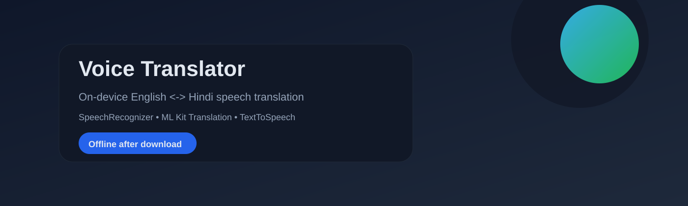
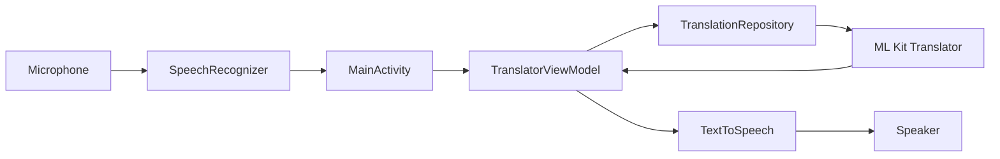
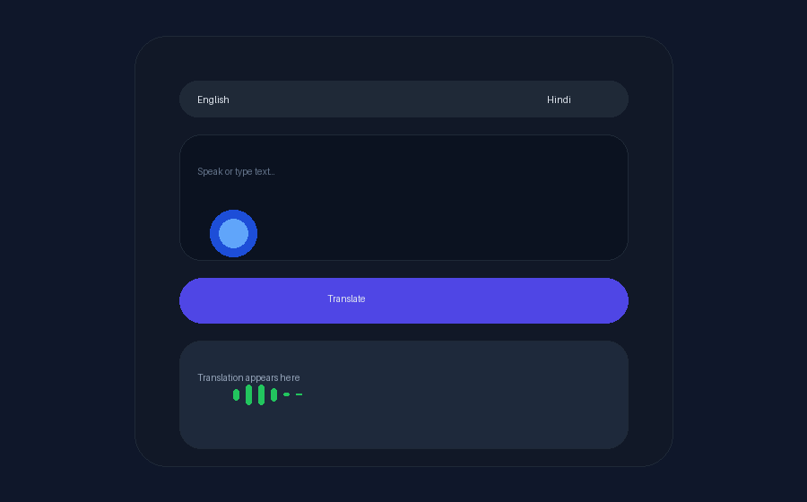
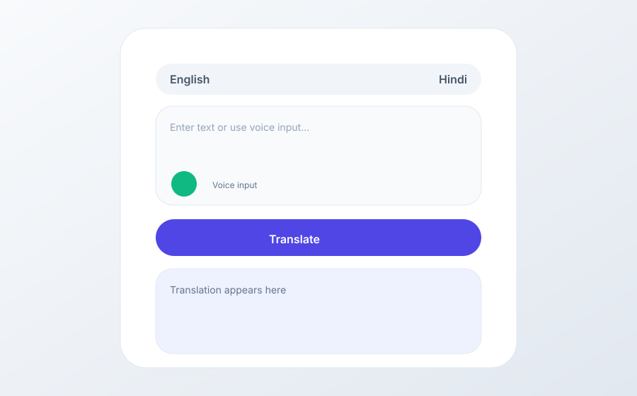
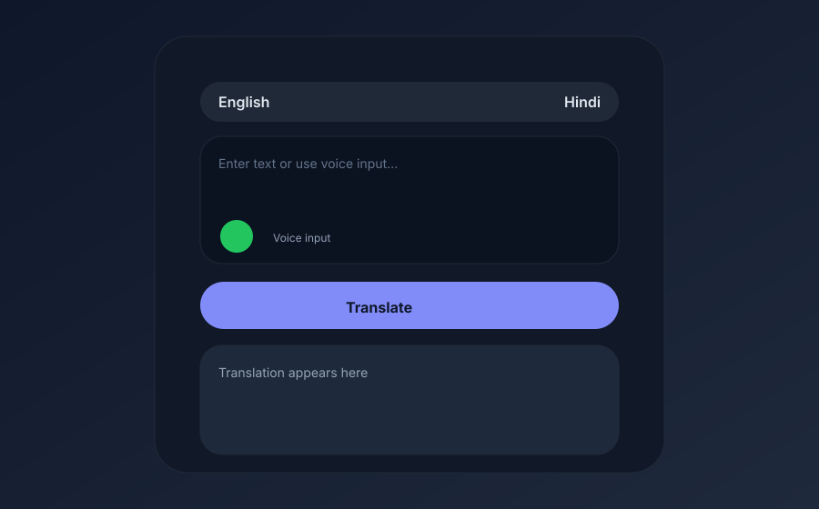

<p align="center">
  
</p>

<h1 align="center">Voice Translator</h1>
<p align="center"><b>English &lt;-&gt; Hindi voice translation for Android, built with Kotlin and ML Kit</b></p>

<p align="center">
  
  
  
  
  
</p>

<p align="center">
  <a href="#-overview">Overview</a> •
  <a href="#-architecture">Architecture</a> •
  <a href="#-installation-guide">Install</a> •
  <a href="#-usage-instructions">Usage</a> •
  <a href="#-project-structure">Structure</a> •
  <a href="#-roadmap">Roadmap</a>
</p>

<p align="center">
  
</p>

---

## 🚀 Overview

A polished Android voice translator that combines speech input, ML Kit translation, and text-to-speech playback in a single on-device experience. Translation models are cached locally after first download, so the app works offline for translation. Voice input uses Android SpeechRecognizer and may depend on device speech services.

> **Why it matters:** Private, fast, and practical translation helps people communicate in real-world settings without relying on cloud translation APIs.

---

## ✨ Key Features

- **Bidirectional translation** between English and Hindi
- **Voice input** with partial results and listening overlay
- **Text-to-speech playback** with language-aware locale switching
- **Swap languages** with instant UI updates
- **Copy & share** translated text
- **Material 3 UI** with light/dark theming and Lottie animation

---

## 🧠 How It Works

1. User speaks or types in the source language.
2. SpeechRecognizer produces text (partial + final results).
3. TranslatorViewModel triggers ML Kit translation.
4. UI updates in real time with loading and final output.
5. TextToSpeech reads the translation aloud.

> **Offline note:** Translation works offline after the model download completes. Speech recognition behavior can vary by device and may require network access.

---

## 🏗️ Architecture

<p align="center">
  
</p>



---

## 🛠️ Tech Stack

| Layer | Tools |
|------|------|
| Language | Kotlin, Coroutines, StateFlow |
| UI | Material 3, View Binding, Lottie |
| ML | Google ML Kit Translation |
| Speech | SpeechRecognizer, TextToSpeech |
| Build | Gradle (KTS), Android Studio |

---

## 📸 Demo / Screenshots

<p align="center">
  
</p>

<p align="center">
  
</p>

<p align="center">
  
  
</p>

---

## ⚙️ Installation Guide

1. Clone the repository:

```bash
git clone https://github.com/TharunBabu-05/ARM-NEON-Optimized_On-Device_Speech-to-Speech_Translation_for_Android.git
```

2. Open in Android Studio (Hedgehog or newer)
3. Sync Gradle and run on an Android device

### Build Debug APK

```bash
./gradlew assembleDebug
```

APK output:
- app/build/outputs/apk/debug/app-debug.apk
- VoiceTranslator-debug.apk (repo root)

---

## ▶️ Usage Instructions

- Tap **Voice** to start listening
- Speak in the selected language
- Tap **Translate** to get results
- Tap **Speaker** to listen to the translation
- Use **Swap** to switch languages instantly

---

## 📂 Project Structure

```
app/
├── src/main/
│   ├── java/com/voicetranslator/
│   │   ├── data/
│   │   │   ├── model/
│   │   │   │   ├── Language.kt
│   │   │   │   ├── ModelDownloadState.kt
│   │   │   │   └── TranslationResult.kt
│   │   │   └── repository/
│   │   │       └── TranslationRepository.kt
│   │   └── ui/
│   │       ├── MainActivity.kt
│   │       ├── SplashActivity.kt
│   │       ├── state/
│   │       │   └── TranslatorUiState.kt
│   │       └── viewmodel/
│   │           └── TranslatorViewModel.kt
│   └── res/
│       ├── drawable/
│       ├── layout/
│       ├── values/
│       └── raw/
```

---

## 🔌 API / Modules

| Module | Responsibility |
|--------|----------------|
| TranslationRepository | Model download + translation calls |
| TranslatorViewModel | UI state, translation flow, model readiness |
| TranslatorUiState | StateFlow-backed UI state |
| MainActivity | Speech input, UI actions, TTS output |
| SplashActivity | Branded splash and entry flow |

---

## 📊 Performance / Results

| Metric | Status |
|--------|--------|
| Translation latency | TBD (varies by device) |
| Model download size | ML Kit models (~30MB each, once) |
| Offline translation | Supported after download |

---

## 🧭 Comparison (On-device vs Cloud)

| Capability | This App | Typical Cloud Translator |
|------------|----------|--------------------------|
| Privacy | On-device after download | Server-side processing |
| Offline translation | Yes | No |
| Network dependency | Limited | Required |
| Latency | Low after download | Variable |

---

## 🌍 Real-world Applications

- Travel and navigation
- Education and language learning
- Workplace collaboration
- Customer support kiosks
- Accessibility and assisted communication

---

## 💼 Recruiter-Friendly Highlights

- MVVM architecture with StateFlow-driven UI
- Integration of Android SpeechRecognizer + TextToSpeech
- ML Kit translation with model lifecycle management
- Clean Material 3 UI with custom components
- Coroutines for async translation pipeline

---

## 🧪 Roadmap

- Add more languages through ML Kit selection
- Improve offline speech recognition support
- Add waveform visualization while listening
- Explore device-specific acceleration (NNAPI / ARM optimizations)

---

## 🤝 Contributing Guidelines

1. Fork the repo
2. Create a feature branch
3. Make changes with clear commit messages
4. Submit a pull request with screenshots or notes

---

## 📜 License

MIT License. See LICENSE.

---

## 🙌 Acknowledgements

- Google ML Kit Translation
- Material Design 3
- Lottie animations

---

## 📬 Contact / Author

- GitHub: https://github.com/TharunBabu-05

---

## 📈 GitHub Stats

<p align="center">
  
  
</p>

<p align="center">
  
</p>

---

<details>
  <summary><b>Implementation Notes</b></summary>
  <br />
  <ul>
    <li>Translation models are downloaded on first launch and cached locally.</li>
    <li>Voice input uses Android SpeechRecognizer and may rely on device services.</li>
    <li>The listening overlay uses a Lottie animation in res/raw.</li>
  </ul>
</details>

<details>
  <summary><b>Why This Project Matters</b></summary>
  <br />
  <ul>
    <li>Shows end-to-end on-device ML integration.</li>
    <li>Demonstrates speech UX design and state management.</li>
    <li>Highlights Android best practices in a production-style app.</li>
  </ul>
</details>
