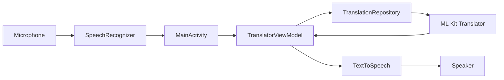

<p align="center">
  
</p>

<h1 align="center">Voice Translator (English &lt;-&gt; Hindi)</h1>

<p align="center">
  On-device speech translation for Android with speech input, instant text translation, and voice playback.
</p>

<p align="center">
  
  
  
  
  
</p>

---

## Highlights

- On-device translation with Google ML Kit (offline after initial model download)
- Speech input via Android SpeechRecognizer with partial results
- Text-to-speech playback with language-aware locale switching
- MVVM with StateFlow-based UI state
- Material 3 UI, Lottie listening animation, and quick actions (swap, copy, share)

---

## UI Preview

<p align="center">
  
</p>

<p align="center">
  
  
</p>

---

## Architecture

This app follows MVVM and keeps the translation logic inside a repository. The UI layer (MainActivity) listens to a StateFlow, triggers translation, and controls speech input/output.



### Key Components

- MainActivity: speech input, text input, and UI actions (swap, copy, share, speak)
- TranslatorViewModel: owns UI state and translation lifecycle
- TranslationRepository: ML Kit model download and translation calls
- Lottie overlay: listening animation during voice input

---

## App Flow

1. App starts and downloads English and Hindi translation models (Wi-Fi required on first run).
2. User types or speaks; source text updates the StateFlow.
3. Translate triggers ML Kit, updates UI with loading and results.
4. Text-to-speech plays the translated result.

---

## Tech Stack

- Kotlin, Coroutines, StateFlow
- AndroidX, Material 3, View Binding
- ML Kit Translation API
- Android SpeechRecognizer and TextToSpeech
- Lottie animations

---

## Requirements

- Android 7.0 (API 24) or higher
- Internet connection for initial model download
- Microphone permission for voice input

---

## Permissions

| Permission | Purpose |
|------------|---------|
| INTERNET | Download translation models (first run) |
| RECORD_AUDIO | Voice input |

---

## Build and Run

1. Clone the repository:

```bash
git clone https://github.com/TharunBabu-05/ARM-NEON-Optimized_On-Device_Speech-to-Speech_Translation_for_Android.git
```

2. Open in Android Studio (Hedgehog or newer)
3. Sync Gradle and run the app on a device

### Build Debug APK

```bash
./gradlew assembleDebug
```

APK output:
- app/build/outputs/apk/debug/app-debug.apk
- VoiceTranslator-debug.apk (repo root)

---

## Project Structure

```
app/
├── src/main/
│   ├── java/com/voicetranslator/
│   │   ├── data/
│   │   │   ├── model/
│   │   │   │   ├── Language.kt
│   │   │   │   ├── ModelDownloadState.kt
│   │   │   │   └── TranslationResult.kt
│   │   │   └── repository/
│   │   │       └── TranslationRepository.kt
│   │   └── ui/
│   │       ├── MainActivity.kt
│   │       ├── SplashActivity.kt
│   │       ├── state/
│   │       │   └── TranslatorUiState.kt
│   │       └── viewmodel/
│   │           └── TranslatorViewModel.kt
│   └── res/
│       ├── drawable/
│       ├── layout/
│       ├── values/
│       └── raw/
```

---

## Notes

- Translation models are downloaded on first launch and cached locally.
- Voice input is optional; text translation works without microphone permission.
- The listening overlay uses a Lottie animation from res/raw.

---

## Acknowledgments

- Google ML Kit Translation
- Material Design 3
- Lottie for animations
